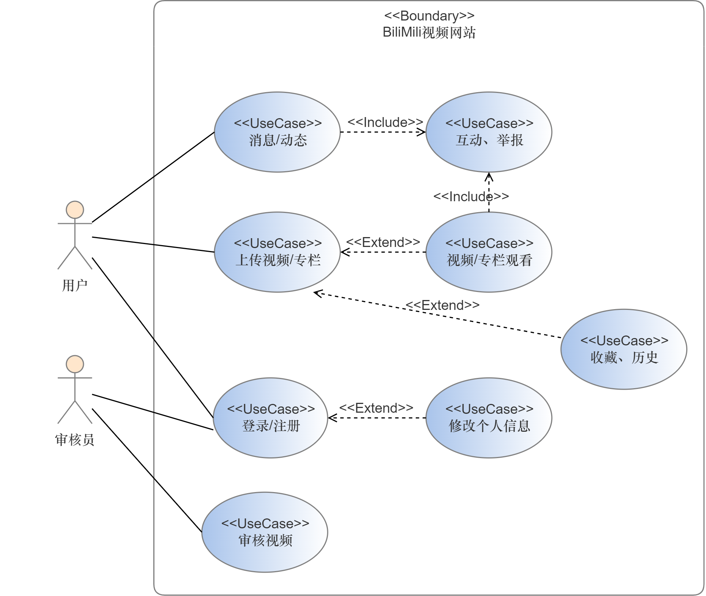
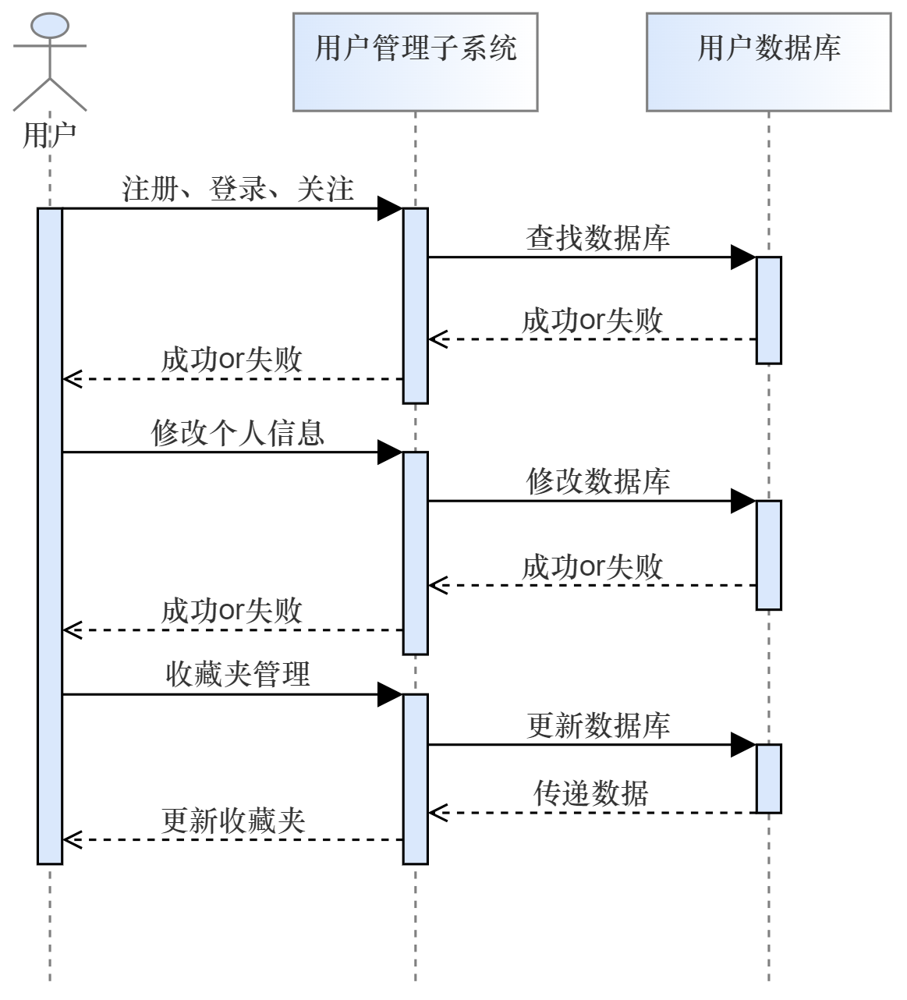
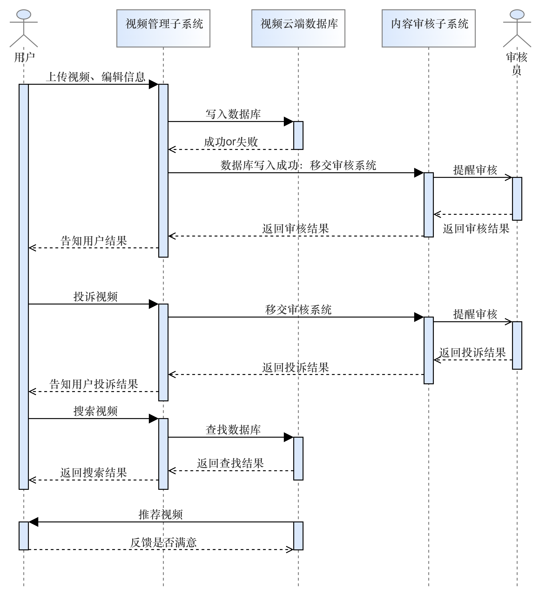

# 软件需求规格说明书

> 1. 《软件需求规格说明》(SRS)描述对计算机软件配置项 CSCI的需求，及确保每个要求得以满足的所使用的方法。涉及该 CSCI外部接口的需求可在本 SRS 中给出：或在本 SRS引用的一个或多个《接口需求规格说明》(IRS)中给出。
> 2. 这个 SRS，可能还要用 IRS加以补充，是CSCI设计与合格性测试的基础。
> 3. 本课程及本实验不涉及、不强调、不关注的部分可省略，但不允许删除已有条目。
> 4. 最终文档请删除所有灰色字体和斜体等说明部分。
> 5. 高亮章节为重点关注章节。

[TOC]

## 1 范围

### 1.1 标识

版本号：1.0

发行号：2024-04-15 Alpha

项目名称：BiliMili视频网站

| 标识号 | 标题                      |
| ------ | ------------------------- |
| 1      | 范围                      |
| 1.1    | 标识                      |
| 1.2    | 系统概述                  |
| 1.3    | 文档概述                  |
| 1.4    | 基线                      |
| 2      | 引用文件                  |
| 3      | 需求                      |
| 3.1    | 所需的状态和方式          |
| 3.2    | 需求概述                  |
| 3.2.1  | 目标                      |
| 3.2.2  | 运行环境                  |
| 3.2.3  | 用户的特点                |
| 3.2.4  | 关键点                    |
| 3.2.5  | 约束条件                  |
| 3.3    | 需求规格                  |
| 3.3.1  | 软件系统总体功能/对象结构 |
| 3.3.2  | 软件子系统功能/对象结构   |
| 3.3.3  | 描述约定                  |
| 3.4    | CSCI能力需求              |
| 3.4.x  | (CSCI能力)                |
| 3.5    | CSCI外部接口需求          |
| 3.5.1  | 接口标识和接口图          |
| 3.5.x  | (接口的项目唯一标识符)    |
| 3.6    | CSCI内部接口需求          |
| 3.7    | CSCI内部数据需求          |
| 3.8    | 适应性需求                |
| 3.9    | 保密性需求                |
| 3.10   | 保密性和私密性需求        |
| 3.11   | CSCI环境需求              |
| 3.12   | 计算机资源需求            |
| 3.12.1 | 计算机硬件需求            |
| 3.12.2 | 计算机硬件资源利用需求    |
| 3.12.3 | 计算机软件需求            |
| 3.12.4 | 计算机通信需求            |
| 3.13   | 软件质量因素              |
| 3.14   | 设计和实现的约束          |
| 3.15   | 数据                      |
| 3.16   | 操作                      |
| 3.17   | 故障处理                  |
| 3.18   | 算法说明                  |
| 3.19   | 有关人员需求              |
| 3.20   | 有关培训需求              |
| 3.21   | 有关后勤需求              |
| 3.22   | 其他需求                  |
| 3.23   | 包装需求                  |
| 3.24   | 需求的优先次序和关键程度  |
| 4      | 合格性规定                |
| 5      | 需求可追踪性              |
| 6      | 尚未解决的问题            |
| 7      | 注解                      |
| 附录   |                           |

### 1.2 系统概述

- **系统和软件的用途**

  该系统的主要用途是允许用户上传、分享和观看视频内容以及设置专栏。它将提供一个用户友好的界面，使用户能够轻松地搜索、浏览、评论和收藏视频及专栏，并且具有审核与管理和消息通知功能。

- **系统的一般特性**

  - 用户注册和登录功能
  - 视频上传和编辑功能
  - 视频搜索和浏览功能
  - 视频播放和评论功能
  - 用户个人资料管理功能

- **开发和运行历史**

  该项目由北航2024春软工课程13小组于2024年春发起，并由该小组开发和维护，预计于教学周第15周完成开发并投入运行。后续将会进行多个版本的迭代和更新。

- **项目参与方**

  - 投资方：北京航空航天大学软件学院
  - 需方：BUAA 2024春 软件工程基础课程组
  - 用户：北京航空航天大学全体在校师生
  - 开发方：BUAA 2024春软工13小组

- **当前和计划的运行现场**

  当前系统处于开发阶段，计划在2024年夏季上线。运行现场包括开发环境和测试环境，目前在本地运行。未来计划提供更加广泛的服务，开放给全校师生使用，计划运行现场是网页端。

### 1.3 文档概述

- **文档用途**
  - **描述系统需求：** 定义视频网站的功能性和非功能性需求，包括用户注册、视频及专栏上传、视频播放、搜索功能等。
  - **指导开发：** 提供了对系统功能和行为的详细描述，帮助开发团队准确实现所需功能。
  - **支持测试：** 作为测试团队的参考，帮助确定测试用例和验证系统是否符合规范。
  - **作为项目基准：** 作为项目的基准文档，对于项目管理、变更控制和迭代开发非常重要。
  - **沟通工具：** 在项目团队和相关利益相关者之间传达需求和期望，确保共识和理解。
- **文档内容**
  - **引言：** 包括文档目的、范围、定义、参考文档等内容。
  - **总体描述：** 描述项目的背景、目标、范围、用户特征等信息。
  - **需求描述：** 具体列出了系统的功能性需求、非功能性需求、接口需求等。
  - **其他部分：** 包括术语和定义、附录、注解等。
- **保密性及私密性要求**
  - **用户隐私保护：** 确保用户的个人信息和隐私数据受到保护，不被未经授权的访问。
  - **数据加密：** 对于敏感数据，如用户密码、支付信息等，采取适当的加密措施保护数据安全。
  - **访问控制：** 实现权限管理和访问控制，确保只有授权用户才能访问特定的内容和功能。

### 1.4 基线

1. **系统架构**：
   - 采用微服务架构，将系统拆分为多个独立的服务，如视频服务、评论服务等，每个服务负责一个特定的功能模块。
   - 前端采用现代化的单页面应用（SPA）架构，实现前后端分离。
2. **技术选型**：
   - 前端：Vue.js，使用 Vuex 管理状态。
   - 后端：采用 Spring Boot  框架，使用 Java 编程语言，结合 MySQL 数据库进行数据存储。
   - 视频等数据存储：采用云存储服务，如阿里云 OSS ，确保数据内容的安全性和可靠性。
3. **数据模型**：
   - 设计用户信息、视频信息、评论信息等核心数据模型，定义数据库表结构和关系，采用 ORM 框架进行对象关系映射。
4. **安全策略**：
   - 实现用户身份认证和授权机制，使用 JWT 或 OAuth2.0 进行用户认证和授权。
   - 提高数据库保密等级，对用户密码等敏感字段信息进行加密存储。
5. **性能考虑**：
   - 针对高并发和大流量场景，采用负载均衡和分布式缓存方案，如 Redis 缓存，提高系统的并发处理能力和响应速度。
6. **用户体验**：
   - 设计响应式的用户界面，确保在不同设备上的良好显示效果。
   - 优化页面加载速度和交互体验，减少用户等待时间，提高用户满意度。
7. **可扩展性和灵活性**：
   - 使用容器化技术，如 Docker 和 Kubernetes，实现系统的自动化部署和扩展，便于随着业务的发展进行系统扩容和升级。
   - 采用消息队列和事件驱动架构，实现系统模块之间的解耦合，方便后续功能的扩展和修改。

## 2 引用文件

1.《BiliMili软件开发计划书》

2.《BiliMili软件概要设计说明书》

3.《GB_T 8567-2006 计算机软件文档 编制规范》

4.《GB∕T+32424-2015+系统与软件工程+用户文档的设计者和开发者要求.pdf》

5.《GBT+9385- 2008+计算机软件需求规格说明规范》

6.《GB∕T+16680-2015+系统与软件工程+用户文档的管理者要求》

## 3 需求

### 3.1 所需的状态和方式

1. **空闲状态**

      - **定义**：用户未登录，系统处于待命状态，等待用户操作。

      - **需求**：
        - 系统应在2秒内响应用户登录或注册请求并给出成功或失败的反馈。
        - 提供视频预览功能，无需登录即可观看视频片段。
        - 当用户执行游客无权执行的操作时，弹出登录框提醒用户进行登录。

2. **准备就绪状态**
   - **定义**：用户登录后，系统加载用户个人设置，准备进入活动状态。

   - **需求**：
     - 系统应在2秒内完成用户数据的加载。
     - 初始化加载用户信息，能够在用户信息栏正确显示用户个人信息。
     - 展示用户观看过的历史视频、发过的动态、收藏过的视频等。

3. **活动状态**

   - **定义**：用户进行视频上传、编辑个人信息、互动评论等操作时，系统处于活动状态。

   - **需求**：
     - 支持用户上传视频，包括视频压缩功能，能够截取或者自行上传封面，应当可以实现类似于B站上传视频的体验；审核端能够看到待审核的视频并做出审核操作，返回用户端。
     - 支持观看视频和观看专栏，能够点赞、举报。
     - 允许用户编辑个人资料并实时更新，如头像、昵称和简介。
     - 实现视频下方的评论区，支持用户发表、回复、点赞、举报评论。

4. **事后分析状态**

   - **定义**：用户完成视频观看或其他活动后，系统提供数据分析和反馈。

   - **需求**：
     - 系统应收集用户观看视频的数据，包括观看时长和相关视频的播放量。
     - 提供用户行为的可视化报告，向用户发送包括粉丝量、关注量、播放量等的创作周报。
     - 用户进行搜索操作后，系统收集搜索关键词、进行热搜推荐。

5. **培训状态**

   - **定义**：新用户或需要帮助的用户，系统提供培训和指导。

   - **需求**：
     - 提供新手引导教程，介绍平台的基本功能和操作。
     - 建立帮助中心，包含常见问题解答和联系客服的入口。
     - 设计易于理解的用户界面，减少用户的学习成本。

6. **降级状态**

   - **定义**：系统维护或遇到异常时，部分功能可能降级。

   - **需求**：
     - 在系统维护期间，保持视频播放功能正常运行。
     - 通过网站公告通知用户当前功能限制和维护时间。

7. **紧急情况状态**

   - **定义**：系统遇到紧急情况，如服务器故障或安全问题。

   - **需求**：
     - 系统应有自动报警机制，立即通知管理员。
     - 启动紧急备份方案，保护用户数据不丢失。
     - 在紧急情况下，提供临时的信息发布页面，告知用户当前状态。

8. **后备状态**

   - **定义**：系统不在主要使用时间或低负载时，进入节能模式。

   - **需求**：
     - 优化服务器资源使用，自动调整负载均衡。
     - 保持基本功能可用，如视频播放和用户登录。

### 3.2 ==需求概述==

#### 3.2.1 目标

- **开发意图**：本系统旨在提供一个互动性强、用户友好的在线视频分享平台，以缓解学习生活压力，促进同学间的分享与交流。
- **应用目标**：解决现有视频平台在用户交互、内容推荐等方面的不足，提供一个更加安全、便捷、个性化的视频分享环境。
- **作用范围**：本系统面向北航全校用户，提供个性化用户界面支持。

- **主要功能**：
  - **视频资源管理**：用户可以上传、编辑、删除视频，可以设置标签、间接、标题、封面等视频信息；可以创建和管理专栏，系统提供视频搜索、推荐、检索、分类等功能。
  - **主页建设和信息管理**：用户可以编辑个人资料，管理收藏夹，查看和关注其他用户，接收更新通知，发布动态等。首页能够随机推送视频，展示轮播图。
  - **视频播放**：提供高质量的视频播放服务，能够倍速、全屏播放，支持弹幕互动、评论互动，记录播放历史。
  - **审核与管理**：实现视频和专栏的投诉与申诉机制，后台审核管理系统支持内容的审核和管理。

- **处理流程**：用户注册后可登录系统，上传视频，与其他用户互动，系统根据用户行为作出相应成功或失败响应并向后端服务器报告。
- **数据流程**：用户数据（播放、关注、动态、视频、专栏等）从客户端流向服务器，经过处理后返回相关信息或视频内容。

- **系统高层次图**：本系统作为独立产品运行，与其他产品无直接关联。但设计时可以考虑与其他社交媒体平台的接口兼容性，以便于未来可能的集成或数据共享。

#### 3.2.2 运行环境

- **硬件环境**：要求服务器具备高性能计算能力和大容量存储空间，以及稳定的网络连接。用户电脑应具有基本的显示、操作等功能，具有一定的显存以成功加载网页。
- **支持环境**：本系统支持包括Windows、macOS在内的PC端操作系统，确保用户可以通过各类主流浏览器和应用访问平台。

#### 3.2.3 用户的特点

- **用户类型**：本系统的目标用户包括学生、教师、视频创作者和普通观众，年轻群体居多。
- **特点**：用户群体对视频内容的质量和多样性有较高要求，同时关注隐私保护和社交互动的便捷性。用户对于视频内容更新迭代的速度要求高。

#### 3.2.4 关键点

- **关键功能**：视频和专栏的上传与展示，用户信息的设置，用户间消息和评论、动态，后台审核等功能。
- **关键技术**：包括但不限于推荐算法、实时互动评论系统、高效的视频处理和存储机制；利用Elasticsearch实现高效而精准的视频搜索机制。

#### 3.2.5 约束条件

- **经费限制**：经济成本几乎为零，人力成本主要为时间成本。
- **开发期限**：必须在本学期大作业deadline前完成所有开发工作并上线测试。
- **技术方法**：采用瀑布模型进行开发，使用Vue作为前端框架，Java作为后端语言。
- **法律法规**：严格遵守国际数据保护法规，如GDPR，以及各国的互联网监管政策。

### 3.3 ==需求规格==

#### 3.3.1 软件系统总体功能/对象结构

- **总体功能**：BiliMili视频网站提供一个全面的视频内容管理系统，包括视频上传、分享、播放、互动和管理等功能，同时支持用户个人主页的定制和社交互动。

- **对象结构**：

  - **用户对象**：包括注册用户和访客，具有不同的权限和功能。注册用户可以上传视频、编辑个人信息、接收通知，而访客主要浏览和播放视频。
  - **视频对象**：包含视频元数据（如标题、描述、标签）、内容（视频文件）、评论和专栏信息。
  - **社交对象**：包括用户关系（如关注关系）、消息提醒（如新视频通知）、动态更新（如专栏更新）等。

- **用例图**：

  

#### 3.3.2 软件子系统功能/对象结构

- **用户管理子系统**：

  - **功能模块**：注册、登录、个人信息编辑、密码管理、收藏夹管理、关注用户。

  - **顺序图**：

    

- **视频管理子系统**：

  - **功能模块**：视频上传、格式转换、视频编辑、专栏管理、视频推荐、视频检索。
  - **顺序图和下面的内容审核子系统一同给出**

- **内容审核子系统**：

  - **功能模块**：投诉处理、内容审查、申诉处理、管理员操作、用户反馈。

  - **顺序图**：

    

#### 3.3.3 描述约定

- **数学符号**：使用标准的数学符号表示算法和计算过程，例如使用 $$\Sigma$$ 表示求和。
- **度量单位**：数据存储使用字节（B）、千字节（KB）、兆字节（MB）等，时间使用秒（s）、毫秒（ms）等，速度使用Mbps或Gbps。
- **编码约定**：字符编码使用UTF-8，数据库编码使用统一的数据库字符集，如UTF-8或相应的SQL字符集。

### 3.4 ==CSCI能力需求==

### 3.4 CSCI能力需求

#### 3.4.1 用户账户管理能力

- **功能**：允许用户创建、管理账户，包括登录、登出、注册、个人信息编辑和密码重置。
- **性能**：
  - **响应时间**：登录和登出操作应在2秒内完成，注册过程不超过1分钟。
  - **容量**：系统应支持至少100个用户账户，且能够处理每分钟至少10次的登录请求。
- **异常处理**：非法登录尝试应记录并通知管理员。密码重置功能应通过电子邮件验证用户身份。
- **输出**：用户操作结果反馈，包括成功、失败及错误信息提示。

#### 3.4.2 视频内容管理能力
- **功能**：允许用户上传、编辑、删除视频，以及创建和管理专栏。
- **性能**：
  - **吞吐时间**：视频上传处理时间不超过5分钟，视频编辑和删除操作应即时响应。
  - **精度**：视频元数据编辑应无误差保存，支持高清视频格式。
  - **容量**：系统应能存储至少10TB的视频内容，并支持单个视频文件最大512MB。
- **异常处理**：上传失败应提供重试选项，并在系统级别记录错误。视频处理过程中的任何错误都应通知用户并提供解决方案。
- **输出**：视频上传、编辑、删除操作的结果反馈，以及视频处理进度的实时更新。

#### 3.4.3 社交互动能力
- **功能**：支持用户之间的关注、消息提醒、评论互动和私信通信。
- **性能**：
  - **响应时间**：消息提醒和评论应在1秒内显示，私信通信应在2秒内送达。
  - **容量**：系统应支持每天至少1000条消息和评论，且能够存储至少1年的社交活动数据。
- **异常处理**：社交互动功能故障时，应提供维护通知，并记录详细错误信息。用户应能够报告不当内容，并得到及时处理。
- **输出**：社交互动结果，包括新的关注、评论、动态和消息通知等。

#### 3.4.4 内容审核与安全能力
- **功能**：实现内容的投诉处理、审核、申诉和管理员操作。
- **性能**：
  - **时限约束**：投诉应在24小时内得到响应，审核结果应在审核成功后及时通知用户。
- **异常处理**：在审核系统故障时，应启动备用系统，并通知管理员。所有投诉和申诉操作应有日志记录，以便追踪和审计。
- **输出**：审核结果通知，包括内容下架、申诉成功或失败的反馈，以及必要时的用户警告或封禁。

#### 3.4.5 系统稳定性与可靠性能力
- **功能**：确保系统的稳定运行和数据的完整性。
- **性能**：
  - **连续运行需求**：系统应有尽可能长的正常运行时间，且在系统升级或维护期间应有最小的停机时间。
  - **基于运行条件的允许偏差**：系统负载高峰期间，不得影响核心功能的可用性。
- **异常处理**：应当立即通知技术团队；重要数据应有定期备份和恢复机制，以防数据丢失。
- **输出**：系统状态报告，包括运行时间、故障次数和恢复时间，以及定期的安全审计报告。

### 3.5 CSCI外部接口需求

#### 3.5.1 接口标识和接口图
- **接口标识**：为了确保清晰的接口管理，每个接口都有一个项目唯一标识符。
- **接口图**：详细描述了CSCI与外部实体之间的数据交换关系，包括用户、硬件、软件和通信接口。

#### 3.5.2 用户接口
**用户登录界面**

- **功能**：允许用户输入用户名和密码进行登录，并提供忘记密码和注册新账户的选项。
- **数据元素**：
  - 用户ID（主键，整数类型）
  - 用户名（字符串，20字符以内）
  - 密码（字符串，加密存储）
- **优先级别**：高，必须实时响应用户输入。
- **保密性**：密码必须通过安全的加密算法进行加密传输和存储。

#### 3.5.3 硬件接口
**视频上传硬件接口**

- **功能**：允许用户通过硬件设备上传视频文件，支持多种视频格式。
- **数据类型**：视频文件（二进制，支持多种编码格式，最大2GB）。
- **优先级别**：中，确保视频上传过程稳定且有良好的用户反馈。

#### 3.5.4 软件接口
**数据库访问接口**

- **功能**：提供CSCI访问数据库的能力，包括执行查询和更新操作。
- **数据元素**：
  - SQL查询（字符串，符合SQL语法）
  - 数据库记录（结构化数据，包含多个字段）
- **优先级别**：高，保证数据访问的实时性和准确性。

#### 3.5.5 通信接口
**网络通信接口**

- **功能**：支持CSCI通过网络与其他系统交换数据，包括API请求和响应。
  - **通信方法**：
    - HTTP/HTTPS协议
    - TCP/IP网络协议

- **数据传送速率**：至少100Mbps，支持高并发访问。

- **安全性**：使用SSL/TLS加密，实现数据传输的安全性。

#### 3.5.x （接口的项目唯一标识符）
- **接口特性**：详细描述每个接口的数据元素和集合体的特性，包括大小、格式、计量单位、范围、准确度、精度、优先级别、时序、频率、容量、序列等。
- **数据元素特性**：
  - **名称/标识符**：例如，用户ID（整数，范围1~10^6）。
  - **数据类型**：例如，用户密码（字符串，要求由6位以上的数字和字母组成）。
  - **大小和格式**：例如，评论内容（字符串，最大500字符）。
  - **计量单位**：例如，视频播放时长（整数，单位秒）。
  - **范围或可能值**：例如，用户年龄（整数，范围0~120）。
  - **准确度和精度**：例如，视频观看次数（整数，无小数点）。
  - **来源和接收者**：例如，视频文件（来源：用户设备，接收者：CSCI服务器）。
- **数据元素集合体特性**：
  - **名称/标识符**：例如，用户资料（包含多个数据元素，如姓名、邮箱、注册日期）。
  - **显示特性**：例如，用户界面（颜色、布局、字体等视听特性）。
  - **数据元素集合体之间的关系**：例如，用户评论（按时间顺序排序）。
- **通信方法特性**：
  - **通信链接**：例如，用户设备与服务器之间的网络连接。
  - **消息格式化**：例如，API请求和响应的JSON格式。
  - **流控制**：例如，网络请求的速率限制和负载均衡。
- **协议特性**：
  - **协议优先级别**：例如，实时视频流的高优先级传输。
  - **合法性检查**：例如，用户输入验证和错误处理。
  - **同步**：例如，数据库事务的ACID属性保证。

### 3.6 CSCI内部接口需求

- **用户登录模块与用户信息模块之间的接口**：
    - 描述：用户登录后，需要获取用户的个人信息。
    - 规范：用户登录模块应调用用户信息模块的接口，传递用户ID，以获取用户的详细信息。
-  **视频上传模块与视频处理模块之间的接口**：
    - 描述：用户上传视频后，需要对视频进行处理（例如转码、截取封面等）。
    - 规范：视频上传模块应调用视频处理模块的接口，传递视频文件和处理参数，以完成视频处理。
- **评论模块与用户通知模块之间的接口**：
    - 描述：当用户发表评论时，需要通知相关用户。
    - 规范：评论模块应调用用户通知模块的接口，传递评论内容和相关用户ID，以触发通知。
- **用户反馈接口**：
    - 描述：用户可以对观看过的视频进行评分、点赞、评论或标记为“已看过”。
    - 规范：
        - 接收用户的反馈数据，包括视频ID、用户ID、评分、喜欢/不喜欢标记等。
- **推荐系统接口**：
    - 描述：推荐系统根据用户的历史行为和反馈，生成个性化的视频推荐列表。
    - 规范：
        - 请求用户兴趣模型，获取用户的偏好和历史行为数据。
        - 根据用户的兴趣和其他因素，生成推荐列表。

### 3.7 ==CSCI内部数据需求==

- **用户数据存储**：
    - 描述：存储用户的个人信息，例如用户名、密码、电子邮件地址、个人偏好等。
    - 规范：定义用户数据表的结构、字段、索引以及数据访问权限。
- **视频信息数据库**：
    - 描述：存储视频的元数据，例如标题、描述、上传日期、标签、时长等。
    - 规范：定义视频信息表的数据模型，以支持视频搜索、排序和推荐功能。
- **用户行为日志**：
    - 描述：记录用户的行为，例如观看历史、点赞、评论、分享等。
    - 规范：定义日志表的结构，包括时间戳、用户ID、操作类型等。
- **推荐系统数据**：
    - 描述：存储推荐系统所需的数据，例如用户兴趣模型、视频特征向量等。
    - 规范：定义数据表、数据格式和更新频率。

### 3.8 适应性需求

- **网络环境适应性**：根据用户的网络速度和带宽，自动调整视频的质量和加载速度，以确保流畅的播放体验。
- **设备适应性**：确保网站在不同设备上（如手机、平板电脑、电视等）都能正常运行，界面布局合理且易于操作。

### 3.9 保密性需求

- **用户隐私保护**：
    - 确保用户的个人信息（如姓名、地址、电子邮件等）得到保护，不被未经授权的人访问。
    - 使用加密技术来存储和传输用户数据，以防止数据泄露。
- **访问控制**：
    - 实施严格的访问权限控制，确保只有经过授权的用户可以访问敏感数据。
    - 防止未经授权的访问，例如使用角色基础的访问控制列表（ACL）。
- **加密和数据保护**：
    - 对存储在数据库中的敏感数据（如用户密码、支付信息）进行加密。
    - 使用HTTPS协议来加密数据传输，以防止中间人攻击。
- **审计和日志记录**：
    - 记录用户的操作，包括登录、访问、修改等。
    - 审计日志有助于追踪异常行为和检测潜在的安全问题。
- **防止无效动作**：
    - 确保系统在执行关键操作时，只响应经过授权的请求。
    - 防止误操作或无效操作，例如在发出想要的命令时失败。
    
### 3.10 保密性和私密性需求
- 私密性
    - 用户隐私:通过适当的措施满足用户的隐私需求。考虑以下几点:
    - 数据保护:保护用户数据，包括个人信息和浏览历史。
    - 同意机制:为数据收集和使用实施明确的同意机制。
    - 加密:采用加密协议，保证数据传输的安全性。
    - 匿名化:尽可能匿名化用户数据。
- 保密性
    - 访问控制:实现基于角色的访问控制，限制非授权访问。
    - 身份验证:对用户帐户使用强身份验证方法。
    - 监控:定期监控安全威胁和漏洞。

### 3.11 ==CSCI环境需求==

* **硬件要求**：
  * 存储空间至少100GB
  * 至少4核心处理器和8GB RAM。
  * 一台普通的虚拟私有服务器（VPS）。
* **网络环境**：
  * 用户需要有稳定的网络连接，应当安装有主流浏览器以打开视频网站。
  * 实施有效的防火墙和入侵检测系统（IDS）以保护服务器免受恶意攻击。
  * 使用SSL/TLS协议保护用户数据的传输。
* **系统环境**：
  * 软件可以在MacOS, Windows等操作系统上运行。
  * 使用响应式设计的前端框架Vue.js开发用户界面，使用后端开发框架Node.js来构建服务器端逻辑。
  * 使用可靠的关系型数据库MySQL来存储和管理数据

### 3.12 计算机资源需求

#### 3.12.1 计算机硬件需求

**硬件环境**：用户需要一台输入/输出功能完善，网络功能达到标准的的个人计算机。

#### 3.12.2 计算机硬件资源利用需求

* **输入设备能力**：用户的鼠标可以顺利完成点击平台响应项的操作，键盘可以正常输入文字。
* **输出设备能力**：用户的显示器可以正常显示平台应有的可视化效果。

#### 3.12.3 计算机软件需求

**操作系统**：用户的个人计算机应配备一种现今主流的操作系统，如MacOS, Windows等。

#### 3.12.4 计算机通信需求

**通信地理位置需求**：由于版权问题，平台只可以在中国大陆地区使用。平台会检查用户的IP地址，用户IP地址在中国大陆范围内方可使用平台。

### 3.13 ==软件质量因素==

**功能性**

1. 作为最核心的功能，平台的视频播放功能需要做到在网络需求达标的前提下流畅播放，并能根据网络质量自动设置足以流畅播放的初始清晰度；
2. 平台的互动功能需要做到即时性和友好性，即用户做出的互动，如点赞、评论等可以即时被显示，并能通过关键词审查功能自动筛选掉带有侮辱性和人身攻击词汇的评论；
3. 平台的视频上传功能同样需要做到即时性，在用户发布的视频审查通过后即时上传。

==次要关注点==

1. **可靠性**：用户的个人数据必须做到安全保存，应采用安全程度足够的加密工具对用户的私人数据进行加密；
2. **易用性**：平台的功能需要做到清晰易懂，根据功能名称即可大概理解功能的作用，并需要在适当位置配以功能作用的描述和介绍。

### 3.14 设计和实现的约束

* 前端：平台使用Vue框架进行前端开发。
* 后端：平台使用Springboot框架进行后端开发。
* 数据库：平台使用MySQL作为平台数据库，使用DBeaver作为数据库的可视化管理工具。
* 美术风格：平台参考”Bilibili“网站的设计风格，辅以符合工程师自己创造性想法的适应性修改。

### 3.15 数据

* **输入数据**：系统的输入数据分为用户信息和视频信息，用户信息包括用户的用户名、密码、性别等个人信息，视频信息包括视频本身、视频创作者、视频播放量等。
* **输出数据**：系统的输出数据包括实现的各个网站页面，包括登录页面、网站主页、视频播放页面等。

### 3.16 操作

* **常规操作**：平台绝大多数的常规操作通过鼠标点击和滚轮滚动完成，如点击进入视频页面、浏览平台主页等；
* **输入操作**：平台的互动功能中的评论功能通过键盘输入完成，用户在评论区输入自己想要评论的文字，并可以发送平台提供的动画表情；
* **视频播放操作**：用户在使用平台的视频播放功能过程中，可以通过键盘的播放快捷键来调整视频进度，调整视频缩放程度等。

### 3.17 故障处理

#### 1. 属于软件系统的问题

- 确定故障是否由软件系统引起，例如应用程序崩溃、功能失效等。
- 记录故障的详细信息，包括时间、错误描述和相关操作。

#### 2. 错误信息

- 当发生错误时，系统应提供清晰的错误信息，以帮助用户或维护人员识别问题。
- 错误信息应包括错误代码、错误描述和可能的原因。

#### 3. 补救措施

- 根据故障的严重性和影响**，**采取相应的补救措施：
  - **轻微故障**：例如界面显示异常，可以尝试刷新页面或重新启动应用程序。
  - **严重故障**：例如数据库崩溃，需要立即通知维护人员并进行紧急修复。
- 在故障处理过程中，应记录所有操作和修复步骤，以便后续分析和改进。

### 3.18 算法说明

#### 1. 推荐系统算法

- **概述：**
  - 推荐系统算法是采用某种机器学习算法来对召回阶段的结果（推荐系统一般会使用多种召回算法）进行二次打分排序，获得对召回结果的统一评价。
  - 根据用户的选择，确定视频标签，并最终给出视频推荐。

#### 2. 热度分析算法

- **概述：**
  - 通过分析当前视频的完播率，点赞量和收藏量，与网站内部的平均水平相比，必要时做一个实时排序，确定该视频的热度
  - 可以考虑将热度定量化。

### 3.19 有关人员需求

#### 1. 人员数量

- 需要足够数量的人员来支持系统的使用和维护，包括开发人员、测试人员和技术支持人员。

#### 2. 技能等级

- 人员应具备相应的技能等级，以满足系统开发和维护的需求。
- 开发人员应熟悉系统使用的编程语言和框架。
- 测试人员应能够设计和执行有效的测试案例。

#### 3. 责任期

- 人员的责任期应与项目的生命周期相匹配，确保在整个项目期间都有适当的支持。

#### 4. 培训需求

- 所有人员都应接受适当的培训，以确保他们能够有效地使用和支持系统。
- 应提供定期的培训更新，以跟上系统和技术的发展。

#### 5. 用户数量需求

- 系统应能够支持预期的同时在线用户数量，确保性能不受影响。

#### 6. 内在帮助和培训能力

- 系统应提供内置的帮助文档和培训材料，以支持用户的自助服务。
- 应提供在线教程和FAQ，以帮助用户解决常见问题。

#### 7. 人力行为工程需求

- 系统设计应考虑人们的能力和局限性，以减少操作错误。
- 应设计直观的用户界面，使用清晰的错误消息和指示器，以提高用户体验。

### 3.20 有关培训需求

- 根据相关时间安排，对于研发后端的人员，应展开Java和python的相关后端组件的自我培训。
- 对于前端人员，展开html，JavaScript以及Vue的培训，确保能够快速上手开发

### 3.21 有关后勤需求

- 对现有设备，设施影响：无
- 需要保障开发人员身心健康与劳逸结合

### 3.22 其他需求

- **暂无**

### 3.23 包装需求

- 本项目采用网络开发，成品是一个网站内容，不必考虑包装问题。

### 3.24 需求的优先次序和关键程度

#### 1. 高优先级需求

- 开发人员数量需求
- 技能等级需求
- 用户数量需求
- 人力行为工程需求

#### 2. 中优先级需求

- 责任期需求
- 培训需求
- 内在帮助与培训能力
- 培训需求

#### 3. 低优先级需求

- 其他需求
- 包装需求

## 4 合格性规定

## 5 需求可追踪性

- **CSCI到系统需求的追踪**

 确定每个 CSCI的需求。这些可以是系统的不同功能模块，例如用户管理系统、视频上传系统、视频播放系统等。并需求规格说明书中清晰地描述每个 CSCI 的需求。对于每个 CSCI，表述其功能需求、性能需求、界面需求、安全性需求等。

 - 功能需求：
   - 允许用户上传视频文件。
   - 提供上传进度显示和上传速度控制功能。
   - 管理上传队列，支持多个用户同时上传。
 - 性能需求：
   - 在高负载情况下仍能保持稳定的上传速度，最小上传速度为 1 MB/s。
   - 支持大文件上传，最大文件大小为 1 GB。
 - 界面需求：
   - 提供用户友好的上传界面，包括文件选择、上传进度显示等。
   - 支持多语言界面。
 - 安全性需求：
   - 保护用户上传的数据安全，防止恶意文件上传和攻击。

 每个 CSCI 的需求追踪到其所涉及的系统或子系统的需求。可以通过在系统需求的描述中添加注释、标识或者使用跟踪矩阵来实现。

- **系统需求到CSCI需求的追踪**

 确定每个系统或子系统的需求，例如用户管理系统需要实现用户注册、登录、个人资料管理等功能，并在需求规格说明书中清晰地描述每个系统或子系统的需求。对于每个系统或子系统，表述其功能需求、性能需求、界面需求、安全性需求等。

 - 功能需求：
   - 允许用户注册新账号，包括填写用户名、密码、邮箱等信息。
   - 提供用户登录功能，验证用户名和密码，登录成功后跳转到用户个人页面。
   - 允许用户管理个人资料，包括修改密码、更改邮箱等。
 - 性能需求：
   - 用户注册和登录的响应时间应不超过 2 秒。
   - 用户资料修改操作的响应时间应不超过 3 秒。
 - 界面需求：
   - 提供用户友好的注册、登录、个人资料管理界面，支持响应式设计。
   - 界面风格符合网站整体风格，包括颜色、字体等。
 - 安全性需求：
   - 保护用户个人信息安全，采用加密存储用户密码和敏感信息。

## 6 ==尚未解决的问题==

1. **用户权限管理**
   - 尚未明确定义不同用户角色的权限和访问级别。
   - 需要进一步讨论和确定用户权限的细节。

2. **性能优化**
   - 尚未解决系统在高并发情况下的性能问题。
   - 需要进行性能测试和优化。

3. **第三方集成**
   - 尚未明确集成外部服务或API的详细步骤。
   - 需要进一步研究和规划。

4. **国际化支持**
   - 校园内有留学生交流合作，而本视频网站是基于我校学生的，所以需要国际化语言支持
   - 需要进一步讨论和决策。

5. **数据备份和恢复**
   - 尚未制定详细的数据备份和恢复策略。
   - 需要进一步规划和实施。
6. **需求变更控制**
   - 尚未确定需求变更控制机制，没有建立需求变更文档等
   - 应当使用相关CASE工具，如JIRA等协助进行需求管理

## 7 注解

## 附录
